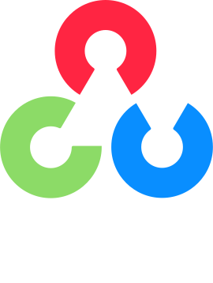

Hello, developer👋. I'm a passionate developer. I enjoy building clean, efficient, and scalable applications, and I'm always eager to learn new things.

## 🔧 Technologies & Tools:
**Languages**   

**Framework/Libraries**   

**Tools**: Git, Docker, AWS, Google Compute Engine, Unity3D   
   
**Database**: MySQL, Firebase

## 📈 GitHub Stats:

